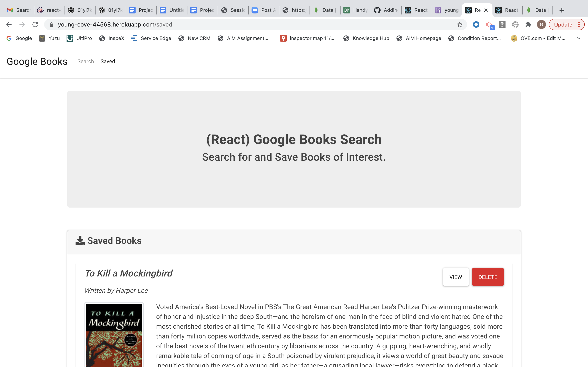
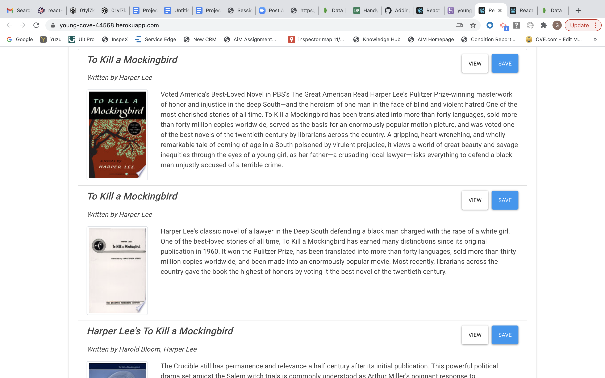
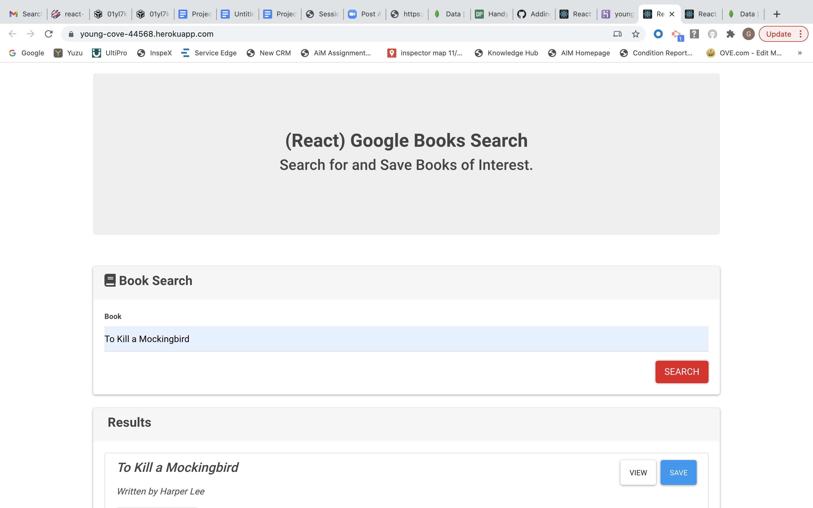

# React Google Book Search

This is a React-based Google Books Search app so that users can save books to review or purchase later.

## Description

This application utilizes React components, working with helper/util functions, and utilizes React lifecycle methods to query and display books based on user searches.

## Deployed Application

### Contact Section

An area for user to contact me directly.

## Visuals

## Link to Deployed Application

https://young-cove-44568.herokuapp.com/

## Future Developments

    1. Rework and add more styling
    2. Add more dynamic features
    3. Include more content throughout

## Support

For questions, comments or concerns regarding this portfolio, please email me at gmilteer@gmail.com

## Contributing

Georgia Milteer
